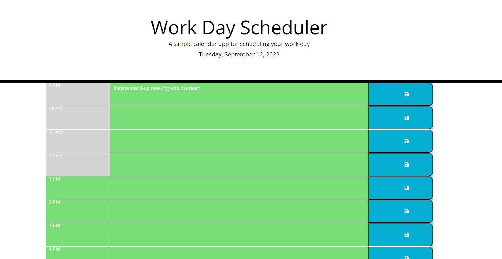

# Daily-Planner-App-w-jquery

A simple calendar app for scheduling your work day. This application allows you to plan and organise your tasks throughout the day, ensuring efficient time management.

DOM manipulation, advanced JavaScript, integration of third-party APIs, and more. This app will run in the browser and feature dynamically updated HTML and CSS powered by jQuery.

## Features

- Display of the current date and time in the header.
- Time blocks for each hour of the workday.
- Color-coded time blocks based on past, present, and future hours.
- Ability to add and save tasks for each time block.
- Persisting tasks between page refreshes using local storage.
- User-friendly interface with notifications for successful task saving.

## Usage

1. Visit the [Work Day Scheduler](https://b70b70.github.io/Daily-Planner-App-w-jquery/) application in your web browser.
2. You will see the current date and time at the top of the page.
3. Each time block represents an hour of the workday, starting from 9 AM to 10 PM.
4. Time blocks are color-coded:
    - Past hours are displayed in gray.
    - The current hour is displayed in red.
    - Future hours are displayed in green.
5. To add a task:
    - Click on the text area for the desired time block.
    - Enter your task or appointment.
    - Click the "Save" button (represented by a floppy disk icon) to save the task.
6. Your task will be saved and displayed in the time block.
7. Your tasks are automatically saved and persist between page refreshes.

## Screenshots

## Technologies Used

- HTML
- CSS
- JavaScript
- [jQuery](https://jquery.com/)
- [Bootstrap](https://getbootstrap.com/)
- [Day.js](https://day.js.org/)

This effort and project was created by Faheem Ali.